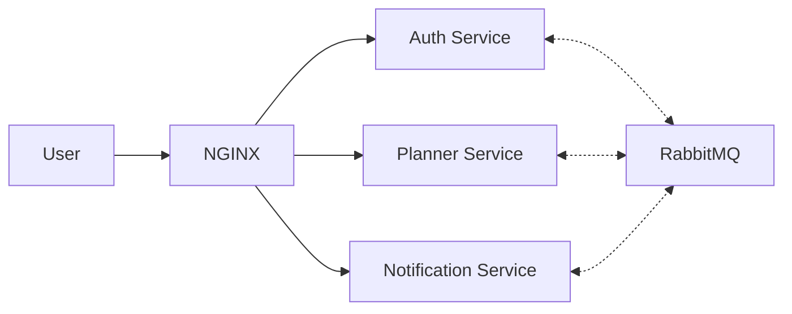
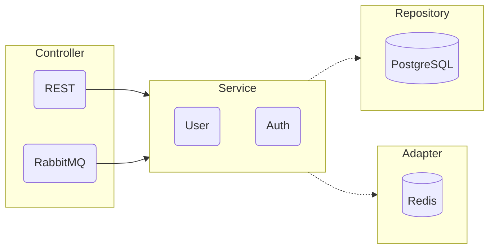
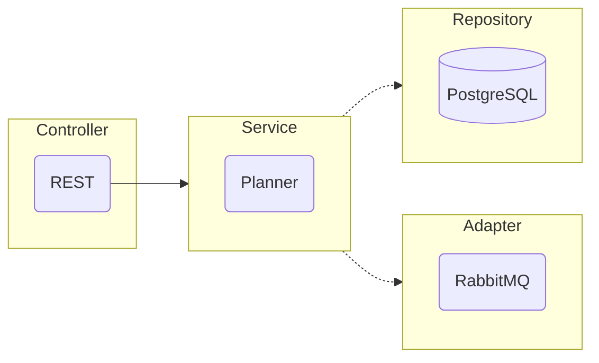
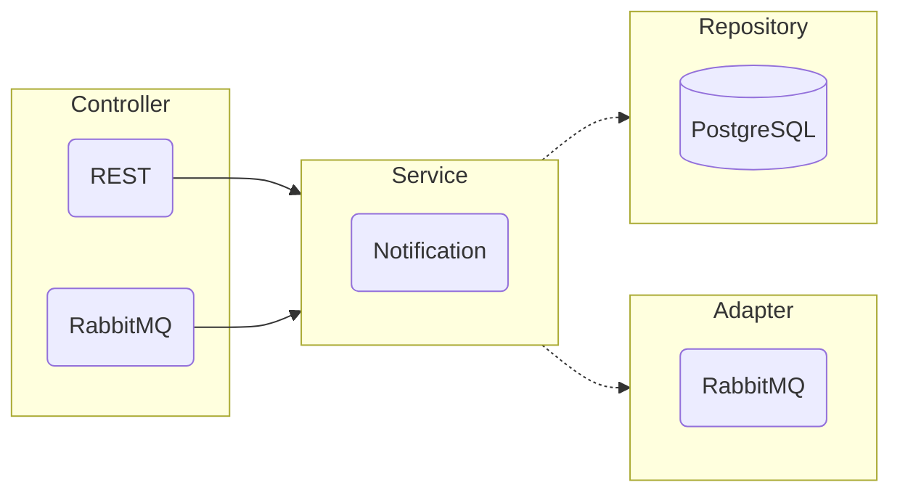

Необходимо реализовать полноценный проект ежедневника с инфраструктурой построенный на docker-compose.

В рамках дипломного проекта, не рассматривается вариант рассылки уведомлений на websocket/email/sms/telegram и т.д.
Достаточно получения списка непрочитанных уведомлений, реализация которых ложится на клиент.

 

Задачи по проекту будут разбиты на 3 уровня важности:

- `*A` **MVP (Minimum Viable Product).**
  Самый важный уровень, включающий основные задачи, необходимые для завершения работы и представления минимально
  жизнеспособной версии дипломной работы.

- `*B` **Оптимизация и улучшение.**
  Задачи, которые могут улучшить дипломную работу, но не являются обязательными.

- `*C` **Задачи со звездочкой.**
  Дополнительные задачи, которые не требуются для завершения дипломной работы, но могут придать ей дополнительную
  ценность или интерес.

 

## Технологии
- **Nginx** (базовый http роутинг по микросервисам)
- **Golang** (основной язык программирования)
- **Redis** (кэш для повторной валидации jwt токена)
- **RabbitMQ** (брокер сообщений для внутреннего меж-сервисного взаимодействия)
- **PosrgreSQL** (база данных)

 

## Инфраструктура

- [x] Настроить docker-compose для запуска проекта `Дима` `*A`
- [x] Добавить bash скрипт для запуска и остановки сервера `Дима` `*B`
- [x] Настроить линтер для проекта `Дима` `*A`
- [x] Добавить bash скрипт для линтинга всех сервисов `Дима` `*B`
- [x] Поднять **nginx** и настроить базовый роутинг `Дима` `*A`
- [x] Поднять брокер сообщений `Дима` `*A`
- [ ] Поднять Redis для кеша валидированных JWT токенов `Дима` `*C`
- [x] Добавить **core** библиотеку и настроить ее импорт в микросервисах `Дима` `*A`
- [x] Добавить общий **logger** для **core** библиотеки `Дима` `*A`
- [x] Написать сборник **rest middleware** для **core** библиотеки `Дима` `*A`
- [x] Написать инструмент для удобной работы с **RabbitMQ** для **core** библиотеки `???` `*A`

 

## Архитектуры проекта
Было принято решение выбрать Event-Driven микросервисную архитектуру без использования API Gateway.

Для общения с клиентом, сервисы будут предоставлять http endpoints. В качестве роутера выступает `nginx`.
Для общения между микросервисами используется брокер сообщений `RabbitMQ`.

 

## Архитектура сервиса Auth

В качестве архитектуры, была выбрана вариация гексоганальной.

- В качестве входных портов используется слой контроллеров.
    - REST для получения внешних запросов от клиента;
    - RabbitMQ для получения внутренних запросов от других микросервисов.

- В качестве инфраструктуры используется слой сервисов.

- В качестве выходных портов используется слой репозиториев и адаптеров.
    - Репозиторий PostgreSQL для хранения постоянного хранения данных
    - Адаптер Redis для кеширования валидированных ранее JWT токенов

#### REST эндпоинты
- `post` `/auth/register` Регистрация аккаунта с хешированием\шифрованием пароля
- `post` `/auth/change_password` Смена пароля
- `post` `/auth/login` Аутентификация пары логин-пароль и генерация JWT токена.

#### RabbitMQ подписки
- `auth.jwt.validation` Валидация токена JWT.

#### Задачи
- [x] Написать Dockerfile и docker-compose для запуска GO контейнера `Дима` `*A`
- [x] Написать Dockerfile и docker-compose для запуска PostgreSQL контейнера `Дима` `*A`
- [x] Настроить конфигурацию по переменным окружения `Дима` `*A`
- [x] Поднять http сервер с необходимыми эндпоинтами `Дима` `*A`
- [ ] Описать бизнес логику в слое Service `???` `*A`
- [ ] Задействовать хеширование\шифрование пароля `???` `*A`
- [ ] Настроить генерацию и валидацию JWT токенов `???` `*B`
- [ ] Настроить необходимые RabbitMQ консюмеры `???` `*A`
- [ ] Написать контракты для http и amqp запросов и ответов `???` `*A`
- [ ] Написать тесты для слоя Service `???` `*A`
- [ ] Написать тесты для слоя Controller `???` `*B`
- [ ] Написать тесты для слоя Repository `???` `*C`
- [ ] Написать тесты для слоя Adapter `???` `*C`
- [ ] Добавить кеширование валидированных JWT токенов через Redis `???` `*C`
- [ ] Написать Swagger документацию к HTTP эндпоинтам `???` `*C`
- [ ] Написать AsyncAPI документацию к RabbitMQ сообщениям `???` `*C`

 

## Архитектура сервиса Planner

В качестве архитектуры, была выбрана вариация гексоганальной.

- В качестве входных портов используется слой контроллеров.
  Для этого сервиса предусмотрен только REST для получения внешних запросов от клиента.

- В качестве инфраструктуры используется слой сервисов.

- В качестве выходных портов используется слой репозиториев и адаптеров.
    - Репозиторий PostgreSQL для хранения постоянного хранения данных
    - Адаптер RabbitMQ для запроса данных из другого микросервиса

#### REST эндпоинты
- `post` `/planner` Добавление задачи
- `get` `/planner` Получение списка задач
- `get` `/planner/{id}` Получение задачи по ID
- `get` `/planner/archive` Получение задач находящихся в архиве
- `patch` `/planner/{id}` Изменение задачи
- `patch` `/planner/done/{id}` Завершение задачи и добавление её в архив
- `delete` `/planner/{id}` Удаление задачи

#### Задачи
- [x] Написать Dockerfile и docker-compose для запуска GO контейнера `Дима` `*A`
- [x] Написать Dockerfile и docker-compose для запуска PostgreSQL контейнера `Дима` `*A`
- [x] Настроить конфигурацию по переменным окружения `Дима` `*A`
- [x] Поднять http сервер с необходимыми эндпоинтами `Дима` `*A`
- [ ] Описать бизнес логику в слое Service `???` `*A`
- [ ] Настроить необходимые RabbitMQ паблишеры с ожиданием ответа `???` `*A`
- [ ] Написать контракты для http и amqp запросов и ответов `???` `*A`
- [ ] Написать тесты для слоя Service `???` `*A`
- [ ] Написать тесты для слоя Controller `???` `*B`
- [ ] Написать тесты для слоя Repository `???` `*C`
- [ ] Написать тесты для слоя Adapter `???` `*C`
- [ ] Написать Swagger документацию к HTTP эндпоинтам `???` `*C`
- [ ] Написать AsyncAPI документацию к RabbitMQ сообщениям `???` `*C`

 

## Архитектура сервиса Notification

В качестве архитектуры, была выбрана вариация гексоганальной.

- В качестве входных портов используется слой контроллеров.
  Для этого сервиса предусмотренно два контроллера:
    - REST для получения внешних запросов от клиента;
    - RabbitMQ для получения внутренних запросов от других микросервисов.

- В качестве инфраструктуры используется слой сервисов.

- В качестве выходных портов используется слой репозиториев и адаптеров.
    - Репозиторий PostgreSQL для хранения постоянного хранения данных
    - Адаптер RabbitMQ для запроса данных из другого микросервиса

#### REST эндпоинты
- `get` `/notification` Получение списка непрочитанных уведомлений
- `patch` `/notification/check/{id}` Пометка уведомления как прочитанного

#### RabbitMQ подписки
- `notification.create` Создание уведомления
- `notification.update` Изменение уведомления
- `notification.delete` Удаление уведомления

#### Задачи
- [x] Написать Dockerfile и docker-compose для запуска GO контейнера `Дима` `*A`
- [x] Написать Dockerfile и docker-compose для запуска PostgreSQL контейнера `Дима` `*A`
- [x] Настроить конфигурацию по переменным окружения `Дима` `*A`
- [x] Поднять http сервер с необходимыми эндпоинтами `Дима` `*A`
- [ ] Описать бизнес логику в слое Service `???` `*A`
- [ ] Настроить необходимые RabbitMQ консюмеры `???` `*A`
- [ ] Настроить необходимые RabbitMQ паблишеры с ожиданием ответа `???` `*A`
- [ ] Написать контракты для http и amqp запросов и ответов `???` `*A`
- [ ] Написать тесты для слоя Service `???` `*A`
- [ ] Написать тесты для слоя Controller `???` `*B`
- [ ] Написать тесты для слоя Repository `???` `*C`
- [ ] Написать тесты для слоя Adapter `???` `*C`
- [ ] Написать Swagger документацию к HTTP эндпоинтам `???` `*C`
- [ ] Написать AsyncAPI документацию к RabbitMQ сообщениям `???` `*C`
- [ ] Настроить Telegram бот для отдачи уведомлений `???` `*C`
- [ ] Настроить WebSocket сервер для отдачи уведомлений `???` `*C`
