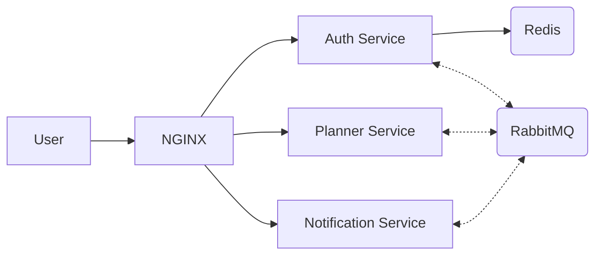
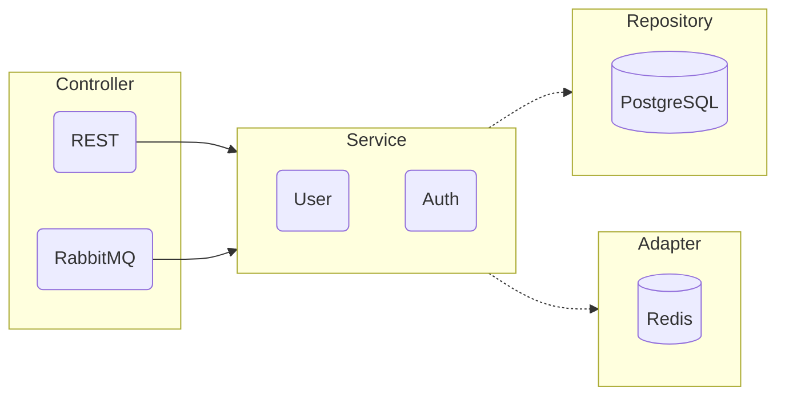
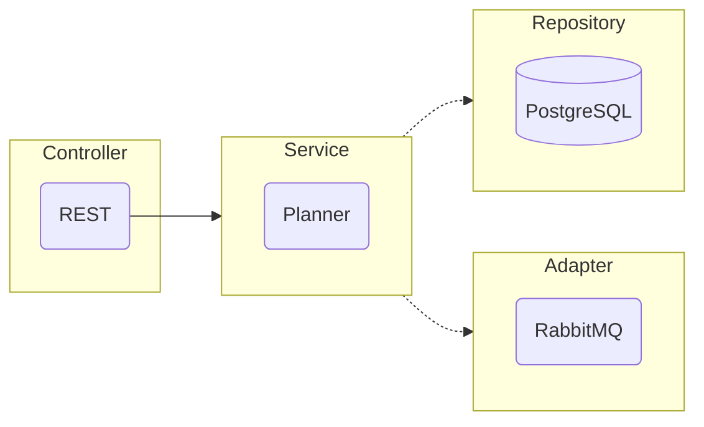
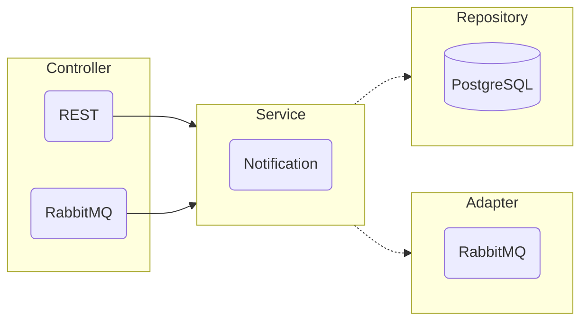

- [Общие требования](#общие-требования)
- [Абстрактная схема взаимодействия с системой](#абстрактная-схема-взаимодействия-с-системой)
- [Технологии](#технологии)
- [Архитектуры проекта](#архитектуры-проекта)
- [Auth Service](#auth-service)
    - [Архитектура](#архитектура)
    - [REST эндпоинты](#rest-эндпоинты)
    - [RabbitMQ подписки](#rabbitmq-подписки)
- [Planner Service](#planner-service)
    - [Архитектура](#архитектура-1)
    - [REST эндпоинты](#rest-эндпоинты-1)
- [Notification Service](#notification-service)
    - [Архитектура](#архитектура-2)
    - [REST эндпоинты](#rest-эндпоинты-2)
    - [RabbitMQ подписки](#rabbitmq-подписки-1)
- [Запуск проекта](#запуск-проекта)

## Общие требования

Необходимо реализовать полноценный проект ежедневника с инфраструктурой построенной на docker-compose.

Пользователю будет доступна HTTP API со следующими бизнес требованиями:

- Регистрация и аутентификация пользователей;
- Добавление, изменение, завершение, удаление и получение списка дел;
- Получать уведомления по задачам.

  

## Абстрактная схема взаимодействия с системой

Ниже представлена абстрактная бизнес-логика взаимодействия пользователя с системой:

1. Пользователь регистрируется в системе;
2. При необходимости пользователь может сменить пароль;
3. Пользователь добавляет задачу в планировщике с возможностью настроить несколько уведомлений;
4. Пользователь может посмотреть свои задачи на сегодня, на неделю, просроченные и бессрочные и завершенные.
5. По достижению необходимого времени, пользователь получает запланированное уведомление;
6. При необходимости пользователь может изменить задачу или перенести уведомления;
7. Пользователь может завершить задачу, которая попадёт в архив.

  

## Технологии

- **Nginx**. Базовый HTTP роутинг;
- **Golang**. Основной язык разработки;
- **Redis**. Кэш для хранения валидированных токенов;
- **RabbitMQ**. Брокер сообщений для внутреннего меж-сервисного взаимодействия;
- **PosrgreSQL**. База данных.

  

## Архитектуры проекта

Было принято решение выбрать Event-Driven микросервисную архитектуру без использования API Gateway.

Для общения с клиентом, сервисы будут предоставлять http ручки. В качестве роутера выступает `nginx`.

Для общения между микросервисами используется брокер сообщений `RabbitMQ`.

  

## Auth Service

Сервис регистрации, аутентификации пользователя.
В этом сервисе также реализован механизм валидации JWT токена для других сервисов.

#### Регистрация

После успешной валидации отправленных данных, в базу сохраняется пользователь.
Пароль предварительно хэшируется\шифруется, а не хранится в базе в открытом виде.

#### Аутентификация

Отправляется запрос для получения JWT токена, сроком жизни в одни сутки.
По истечению срока, токен перестает действовать и требуется повторная авторизация.

#### Задачи со звездочкой

* Реализовать пару access-token / refresh-token, для обновления краткосрочного токена.
* Реализовать кэш ранее валидированных токенов, для ускорения работы.

#### Архитектура

В качестве архитектуры, была выбрана вариация гексоганальной.

- В качестве входных портов используется слой контроллеров.
    - REST для получения внешних запросов от клиента;
    - RabbitMQ для получения внутренних запросов от других микросервисов.

- В качестве инфраструктуры используется слой сервисов.

- В качестве выходных портов используется слой репозиториев и адаптеров.
    - Репозиторий PostgreSQL для хранения постоянного хранения данных
    - Адаптер Redis для кеширования валидированных ранее JWT токенов

#### REST эндпоинты

- `post` `/auth/register` Регистрация аккаунта с хешированием\шифрованием пароля
- `post` `/auth/change_password` Смена пароля
- `post` `/auth/login` Аутентификация пары логин-пароль и генерация JWT токена.

#### RabbitMQ подписки

- `auth.jwt.validation` Валидация токена JWT.

  

## Planner Service

Сервис работы с задачами внутри планировщика. Доступны следующие функции:

- Добавление задачи;
- Получение списка задач на сегодня;
- Получение списка задач на неделю;
- Получение списка задач без даты выполнения;
- Получение списка просроченных задач;
- Получение списка задач в архиве.

#### Работа с уведомлениями

При добавлении или изменении задачи, у пользователя есть возможность указать несколько уведомлений.
Задачи на создание, изменение или удаление уведомлений отправляются в RabbitMQ, который разбирает соответствующий
сервис.

#### Задачи со звездочкой:

* Добавить возможность массово удалять или завершать задачи;
* Добавить возможность поручать задачи другому пользователю и просматривать список порученных задач.

#### Архитектура

В качестве архитектуры, была выбрана вариация гексоганальной.

- В качестве входных портов используется слой контроллеров.
  Для этого сервиса предусмотрен только REST для получения внешних запросов от клиента.

- В качестве инфраструктуры используется слой сервисов.

- В качестве выходных портов используется слой репозиториев и адаптеров.
    - Репозиторий PostgreSQL для хранения постоянного хранения данных
    - Адаптер RabbitMQ для запроса данных из другого микросервиса

#### REST эндпоинты

- `post` `/planner` Добавление задачи
- `get` `/planner/{id}` Получение задачи по ID
- `get` `/planner/today` Получение списка задач на сегодня
- `get` `/planner/week` Получение списка задач на неделю
- `get` `/planner/undated` Получение списка бессрочных задач
- `get` `/planner/overdue` Получение списка просроченных задач
- `get` `/planner/archive` Получение задач в архиве
- `patch` `/planner/{id}` Изменение задачи
- `patch` `/planner/{id}/done` Завершение задачи и добавление её в архив
- `patch` `/planner/{id}/due_date` Изменяет время выполнения
- `delete` `/planner/{id}` Удаление задачи

 

## Notification Service

Сервис для работы с уведомлениями.
Напрямую к нему можно обратиться только за получением списка доступных уведомлений.
Логика получения уведомлений на стадии MVP ложится на сторону клиента.

Для изменения, удаления и пометки уведомления как прочитанного используется брокер сообщений.

#### Задачи со звездочкой:

* Реализовать возможность автоматической отправки уведомлений в Telegram;
* Реализовать websocket клиент для получения уведомлений.

#### Архитектура

В качестве архитектуры, была выбрана вариация гексоганальной.

- В качестве входных портов используется слой контроллеров.
  Для этого сервиса предусмотренно два контроллера:
    - REST для получения внешних запросов от клиента;
    - RabbitMQ для получения внутренних запросов от других микросервисов.

- В качестве инфраструктуры используется слой сервисов.

- В качестве выходных портов используется слой репозиториев и адаптеров.
    - Репозиторий PostgreSQL для хранения постоянного хранения данных
    - Адаптер RabbitMQ для запроса данных из другого микросервиса

#### REST эндпоинты

- `get` `/notification` Получение списка непрочитанных уведомлений
- `patch` `/notification/check/{id}` Пометка уведомления как прочитанного

#### RabbitMQ подписки

- `notification.create` Создание уведомления
- `notification.update` Изменение уведомления
- `notification.delete` Удаление уведомления

  

## Запуск проекта

Для удобного запуска в *nix системах был добавлен Makefile.
Ниже будет приведен список доступных команд.

| Команда             | Описание                                  |
|---------------------|-------------------------------------------|
| `make run-dev`      | Запуск проекта в Development режиме       |
| `make run-prod`     | Запуск проекта в Production режиме        |
| `make stop`         | Останавливает все сервисы                 |
| `make lint`         | Линтинг всего проекта                     |
| `make install-deps` | Устанавливает все необходимые зависимости |

Также для запуска проекта потребуется создать файл `env/.env`.
Шаблон файла можно найти по пути `env/template.env`.