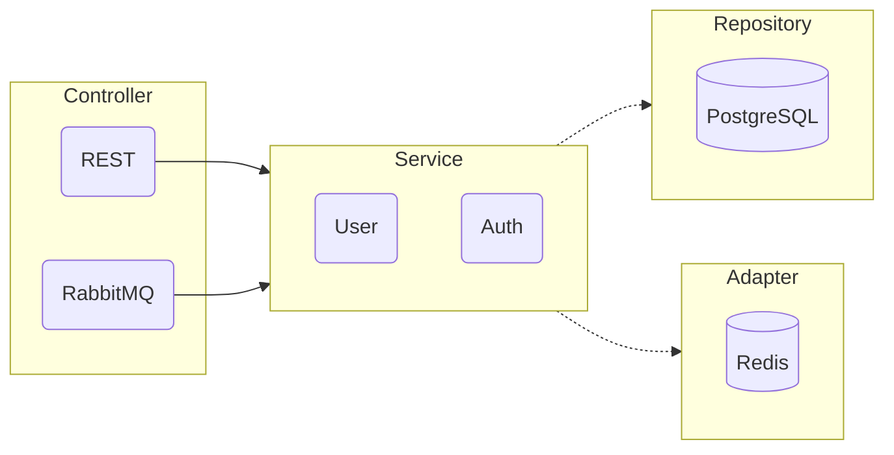

Сервис регистрации, аутентификации пользователя.
В этом сервисе также реализован механизм валидации JWT токена для других сервисов.

Из директории сервиса можно запустить:

| Команда           | Описание                                |
|-------------------|-----------------------------------------|
| `make test`       | Запускает тесты                         |
| `make test-cover` | Показывает покрытие тестами в процентах |

#### Регистрация

После успешной валидации отправленных данных, в базу сохраняется пользователь.
Пароль предварительно хэшируется\шифруется, а не хранится в базе в открытом виде.

#### Аутентификация

Отправляется запрос для получения JWT токена, сроком жизни в одни сутки.
По истечению срока, токен перестает действовать и требуется повторная авторизация.

#### Задачи со звездочкой

* Реализовать пару access-token / refresh-token, для обновления краткосрочного токена.
* Реализовать кэш ранее валидированных токенов, для ускорения работы.

#### Архитектура

В качестве архитектуры, была выбрана вариация гексоганальной.

- В качестве входных портов используется слой контроллеров.
    - REST для получения внешних запросов от клиента;
    - RabbitMQ для получения внутренних запросов от других микросервисов.

- В качестве инфраструктуры используется слой сервисов.

- В качестве выходных портов используется слой репозиториев и адаптеров.
    - Репозиторий PostgreSQL для хранения постоянного хранения данных
    - Адаптер Redis для кеширования валидированных ранее JWT токенов

#### REST эндпоинты

- `post` `/auth/register` Регистрация аккаунта с хешированием\шифрованием пароля
- `post` `/auth/change_password` Смена пароля
- `post` `/auth/login` Аутентификация пары логин-пароль и генерация JWT токена.

#### RabbitMQ подписки

- `auth.jwt.validation` Валидация токена JWT.
