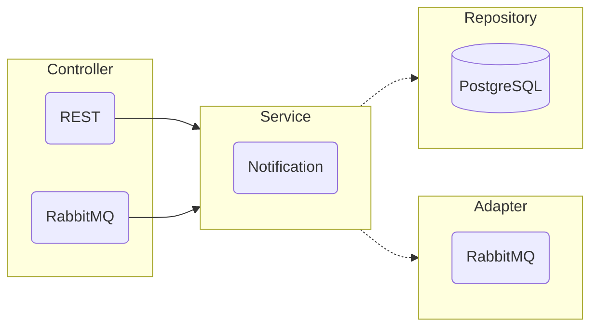

Сервис для работы с уведомлениями.
Напрямую к нему можно обратиться только за получением списка доступных уведомлений.
Логика получения уведомлений на стадии MVP ложится на сторону клиента.

Для изменения, удаления и пометки уведомления как прочитанного используется брокер сообщений.

#### Задачи со звездочкой:

* Реализовать возможность автоматической отправки уведомлений в Telegram;
* Реализовать websocket клиент для получения уведомлений.

#### Архитектура

В качестве архитектуры, была выбрана вариация гексоганальной.

- В качестве входных портов используется слой контроллеров.
  Для этого сервиса предусмотренно два контроллера:
  - REST для получения внешних запросов от клиента;
  - RabbitMQ для получения внутренних запросов от других микросервисов.

- В качестве инфраструктуры используется слой сервисов.

- В качестве выходных портов используется слой репозиториев и адаптеров.
  - Репозиторий PostgreSQL для хранения постоянного хранения данных
  - Адаптер RabbitMQ для запроса данных из другого микросервиса

#### REST эндпоинты

- `get` `/notification` Получение списка непрочитанных уведомлений
- `patch` `/notification/check/{id}` Пометка уведомления как прочитанного

#### RabbitMQ подписки

- `notification.create` Создание уведомления
- `notification.update` Изменение уведомления
- `notification.delete` Удаление уведомления