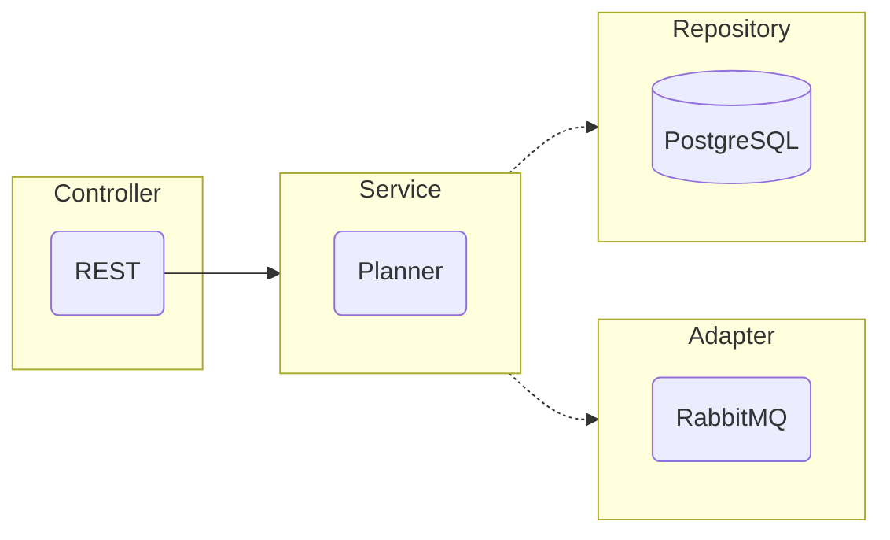

#### Доступные команды

| Команда           | Описание                                    |
|-------------------|---------------------------------------------|
| `make test`       | Запускает тесты                             |
| `make test-cover` | Показывает процент покрытия тестами проекта |

  

Сервис работы с задачами внутри планировщика. Доступны следующие функции:

- Добавление задачи;
- Изменение задачи;
- Получение списка задач на сегодня;
- Получение списка задач на неделю;
- Получение списка задач без даты выполнения;
- Получение списка просроченных задач;
- Получение списка задач в архиве.

#### Архитектура

В качестве архитектуры, была выбрана вариация гексоганальной.

- В качестве входных портов используется слой контроллеров.
  Для этого сервиса предусмотрен только REST для получения внешних запросов от клиента.

- В качестве инфраструктуры используется слой сервисов.

- В качестве выходных портов используется слой репозиториев и адаптеров.
  - Репозиторий PostgreSQL для хранения постоянного хранения данных
  - Адаптер RabbitMQ для запроса данных из другого микросервиса

#### REST эндпоинты

- `post` `/planner` Добавление задачи
- `get` `/planner/{id}` Получение задачи по ID
- `get` `/planner/today` Получение списка задач на сегодня
- `get` `/planner/week` Получение списка задач на неделю
- `get` `/planner/undated` Получение списка бессрочных задач
- `get` `/planner/overdue` Получение списка просроченных задач
- `get` `/planner/archive` Получение задач в архиве
- `patch` `/planner/{id}` Изменение задачи
- `patch` `/planner/{id}/done` Завершение задачи и добавление её в архив
- `patch` `/planner/{id}/due_date` Изменяет время выполнения
- `delete` `/planner/{id}` Удаление задачи
